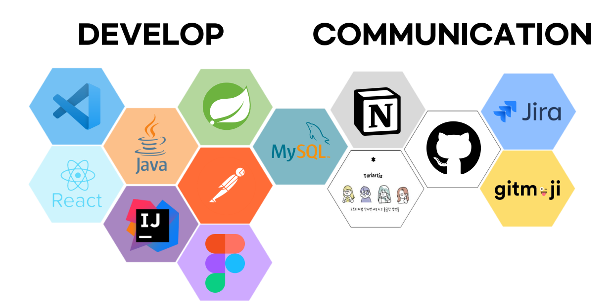

# 2NY

## 프로젝트 개요

### 주제 및 선정 배경

2NY는 여성을 위한 맞춤형 쇼핑몰 플랫폼 입니다.
2NY는 3가지 핵심 가치를 바탕으로 기획하였습니다.
각 고객의 유니크한 스타일 니즈를 충족시키는 개인화, 복잡한 쇼핑 과정을 간소화 하여, 고객들이 쉽고 빠르게 원하는 상품을 찾을 수 있는 효율성, 웹 사이트의 깔끔한 디자인과 함께 세련된 브랜드 이미지를 구축하고자 하는 다양성 입니다.

**컨셉** : 2NY는 "TO New You, 새로운 당신을 위해" 라는 메세지를 전달하며, 각 의미를 담고 있습니다. 
TO - 목적지로 향하는 여정을 의미하며, 패션을 통한 자기발견의 과정
New - 새로움의 의미, 고객이 새로운 스타일과 자신을 발견할 수 있는 공간
You - 고객 개개인을 중요하게 여긴다는 메세지를 전달

### 🔎 Team Member

| 김신이(PL) | 이소현 | 조민준 | 채현영 |
| --- | --- | --- | --- |
|  |  |  |  |
| [@SiNiKin](https://github.com/SiNiKin) | [@LeeSoHyunn](https://github.com/LeeSoHyunn) | [@Rencal3491](https://github.com/Rencal3491) | [@CheHyeonYeong](https://github.com/CheHyeonYeong)  |

### 프로젝트 개요

API를 이용한 웹 애플리케이션

**앱 이름**: 2NY

### 환경설정
**Visual Studio Code 모듈 설치**
- npm install
- npm install @mui/material @mui/styled-engine-sc styled-components
- npm install react-slick slick-carousel
- npm install react-kakao-login
- npm install react-naver-login
- npm install @react-oauth/google
- npm install react-quill

#### 기능 소개

1. **회원관리**
    - 회원가입, 로그인, 회원 정보 수정, 회원 정보 조회, 회원 탈퇴
    - 아이디, 비밀번호 찾기
    - User Role에 따른 정보 제한

2. **상품관리**
    - ChatBot 기능
    - 상품 메인 페이지 (정렬 & 필터링), 상품 상세페이지
    - Admin 계정의 상품 등록 및 수정과 삭제
    - 상품에 대한 리뷰 작성 및 수정,삭제

3. **주문관리**
    - 장바구니 조회, 장바구니 내 상품 추가 및 수정, 삭제
    - 주문 조회, 주문 상세 조회, 주문 등록
    - Admin 계정의 주문 상태 수정
    - 장바구니 or 상품 개별 주문 시 무통장입금/카카오페이 결제 기능

### 활용 장비 및 재료

- Visual Studio Code
- React
- Java 17 SDK
- Spring Boot
- IntelliJ
- PostMan
- MySQL
- Notion
- Jira
- GitHub
- gitmoji
- KakaoTalk

### 프로젝트 구조

#### ERD 및 아키텍처

### 기대 효과

1. **개인화된 쇼핑 경험 향상**:
    - ChatBot 기능과 맞춤형 상품 추천을 통해 각 고객의 스타일 니즈를 파악하고 충족시킬 수 있습니다.

2. **최적화된 서비스**:
    - 직관적인 상품 페이지 구성과 간편한 결제 시스템을 통해 쇼핑 시간을 절감 할 수 있습니다.

3. **브랜드 가치 상승과 시장 확대**:
    - 다양한 사이즈와 스타일을 제공함으로써 브랜드 가치를 창출하고, 이를 통해 잠재적 고객층을 확대할 수 있습니다.

# 프로젝트 수행결과

https://url.kr/5lp1cg
